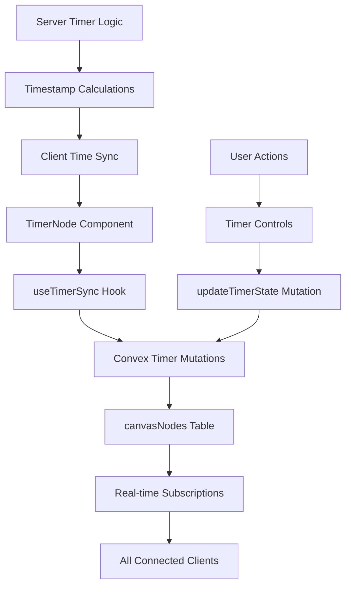

# Design Document

## Overview

The voting timer feature enhances the existing TimerNode component with real-time synchronization capabilities through Convex. This design transforms the current local-only timer into a collaborative tool where all room participants see synchronized timer state. The implementation leverages existing canvas node infrastructure and Convex's reactive query system to provide seamless real-time updates while maintaining the product's core principle of simplicity.

## Steering Document Alignment

### Technical Standards (tech.md)

- **Convex Real-time Architecture**: Uses reactive queries and mutations for timer state synchronization
- **React Flow Integration**: Extends existing TimerNode as a canvas node type
- **TypeScript**: Full type safety with proper interfaces for timer state
- **Debounced Updates**: Timer tick updates optimized to prevent excessive server calls
- **Component Architecture**: Follows established patterns for canvas nodes

### Project Structure (structure.md)

- **File Naming**: Follows kebab-case convention (`timer-node.tsx`, `use-timer-sync.ts`)
- **Component Organization**: Timer remains in `src/components/room/nodes/` directory
- **Convex Functions**: Timer-related functions in `convex/timer.ts` and model in `convex/model/timer.ts`
- **Import Order**: Maintains standard import hierarchy
- **Feature-based Structure**: Timer logic encapsulated within room feature

## Code Reuse Analysis

### Existing Components to Leverage

- **TimerNode.tsx**: Current local timer component provides UI foundation
- **Canvas Node System**: Existing node infrastructure handles positioning and rendering
- **useCanvasNodes Hook**: Manages node state updates and synchronization
- **Convex Canvas Functions**: Pattern for node data persistence and updates

### Integration Points

- **canvasNodes Table**: Timer state stored in existing node data structure
- **resetGame Mutation**: Extended to reset timer when game resets
- **Room Real-time Updates**: Leverages existing room subscription pattern
- **Node Update Pattern**: Uses established `updateNodeData` mutation pattern

## Architecture

The timer synchronization follows the established pattern of canvas node updates with specialized handling for time-sensitive data.



## Components and Interfaces

### Enhanced TimerNode Component

- **Purpose:** Display synchronized timer with play/pause/reset controls
- **Interfaces:**
  - Props: Standard NodeProps with TimerNodeData
  - Actions: onPlay, onPause, onReset handlers
- **Dependencies:** useTimerSync hook, React Flow, Convex mutations
- **Reuses:** Existing TimerNode UI, cn utility, icon components

### useTimerSync Hook

- **Purpose:** Manage timer synchronization logic and server communication
- **Interfaces:**
  - Input: roomId, nodeId
  - Output: { time, isRunning, controls }
- **Dependencies:** Convex hooks (useQuery, useMutation)
- **Reuses:** Existing debounce patterns from canvas updates

### Timer Convex Functions

- **Purpose:** Server-side timer state management and synchronization
- **Interfaces:**
  - startTimer: Begin timing with server timestamp
  - pauseTimer: Pause and record elapsed time
  - resetTimer: Clear timer state
  - getTimerState: Calculate current time based on server clock
- **Dependencies:** Canvas model functions
- **Reuses:** Canvas node update patterns, room activity tracking

## Data Models

### Timer Node Data Structure

```typescript
interface TimerNodeData {
  // Timer state
  startedAt: number | null; // Server timestamp when started
  pausedAt: number | null; // Server timestamp when paused
  elapsedSeconds: number; // Total elapsed seconds
  isRunning: boolean; // Current running state

  // Tracking
  lastUpdatedBy: Id<"users">; // User who last changed timer
  lastAction: "start" | "pause" | "reset";
}
```

### Timer State Calculation

```typescript
interface TimerState {
  currentSeconds: number; // Calculated current time
  isRunning: boolean; // Running state
  displayTime: string; // Formatted "MM:SS"
}
```

## Error Handling

### Error Scenarios

1. **Network Interruption During Timer Running**

   - **Handling:** Client continues local timer, resynchronizes on reconnection
   - **User Impact:** Seamless experience, automatic correction when online

2. **Simultaneous Control Actions**

   - **Handling:** Server processes in order, last action wins
   - **User Impact:** Immediate response, state converges quickly

3. **Clock Drift Between Clients**

   - **Handling:** Server timestamps used for all calculations
   - **User Impact:** Consistent time display across all clients

4. **Timer Node Data Corruption**
   - **Handling:** Validation on server, reset to safe state if invalid
   - **User Impact:** Timer resets to 0:00, notification shown

## Testing Strategy

### End-to-End Testing

- Multiple users viewing same timer
- Timer controls from different users
- Timer behavior during voting flow
- Persistence across page refreshes
- Mobile touch interactions
