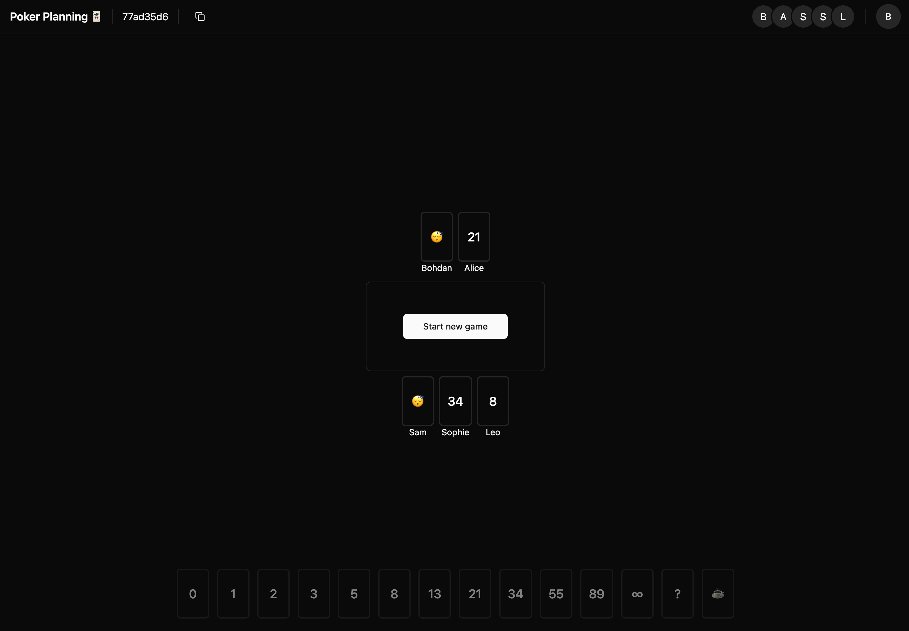

# PokerPlanning.org

[](https://github.com/INQTR/poker-planning/actions/workflows/ci.yml)

PokerPlanning.org is an open-source, user-friendly online planning poker tool designed to enhance Scrum team collaboration and improve estimation accuracy. Our mission is to provide a free, accessible, and enjoyable planning poker experience for teams worldwide 🌍🌎🌏!



## Features 🚀

- **Free to use** - No registration required
- **Real-time collaboration** - Instant updates for all participants
- **Modern canvas interface** - Whiteboard-style room with drag-and-drop
- **Visual voting progress** - See who's voted at a glance
- **Instant results visualization** - Charts and statistics after reveal
- **Auto-cleanup** - Rooms are automatically cleaned up after 5 days of inactivity

## Technology Stack 🛠️

- **Frontend**: Next.js 15 with App Router, React 19, TypeScript
- **Backend**: Convex (serverless functions with real-time reactivity)
- **Styling**: Tailwind CSS 4, shadcn/ui components
- **Canvas**: @xyflow/react for interactive whiteboard functionality
- **State Management**: Convex reactive queries

## Getting Started 🏁

### Prerequisites

- Git
- Node.js 20+ and npm

### Setup

1. Clone the repository:

   ```sh
   git clone https://github.com/INQTR/poker-planning.git
   cd poker-planning
   ```

2. Install dependencies:

   ```sh
   npm install
   ```

3. Set up Convex:

   ```sh
   npx convex dev
   ```

### Running the Application

1. Start the Convex backend (in one terminal):

   ```sh
   npx convex dev
   ```

2. Start the Next.js development server (in another terminal):

   ```sh
   npm run dev
   ```

3. Open [http://localhost:3000](http://localhost:3000) in your browser

## Running Tests 🧪

This project uses Playwright for end-to-end tests.

### End-to-End Tests

To run end-to-end tests:

```sh
npm run test:e2e
```

To run end-to-end tests with UI:

```sh
npm run test:e2e:ui
```

To run end-to-end tests in headless mode:

```sh
npm run test:e2e:headless
```

## Deployment

The application can be deployed to various platforms:

### Frontend (Next.js)

Deploy to Vercel, Netlify, or any platform that supports Next.js applications.

### Backend (Convex)

Deploy to production using:

```sh
npx convex deploy --prod
```

## Contributing 🤝

We welcome contributions! Please feel free to submit a Pull Request.

## License 📜

This project is open source and available under the [MIT License](LICENSE).
